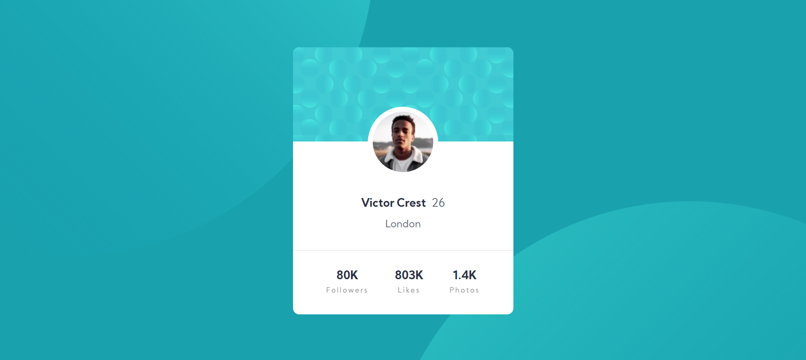

# Frontend Mentor - Profile card component solution

This is a solution to the [Profile card component challenge on Frontend Mentor](https://www.frontendmentor.io/challenges/profile-card-component-cfArpWshJ). Frontend Mentor challenges help you improve your coding skills by building realistic projects. 

## Table of contents

- [Overview](#overview)
  - [The challenge](#the-challenge)
  - [Screenshot](#screenshot)
  - [Links](#links)
- [My process](#my-process)
  - [Built with](#built-with)
  - [What I learned](#what-i-learned)
  - [Continued development](#continued-development)
  - [Useful resources](#useful-resources)
- [Author](#author)
- [Acknowledgments](#acknowledgments)

**Note: Delete this note and update the table of contents based on what sections you keep.**

## Overview

### The challenge

- Build out the project to the designs provided

### Screenshot



Screenshot of my solution.

### Links

- Solution URL: [Add solution URL here](https://your-solution-url.com)
- Live Site URL: [Add live site URL here](https://your-live-site-url.com)

## My process

### Built with

- Semantic HTML5 markup
- CSS custom properties
- Flexbox

### What I learned

In this challenge I learned positioning layouts pretty well.

Code snippets I used here to position the Profile photo in the middle is given below,

```css
.photo-wrapper {
	display: inline-block;
	border-radius: 50%;
	position: relative;
	top: 95px;
	left: 0;
	right: 0;
	margin-left: auto;
	margin-right: auto;
	background: #fff;
}
```

### Continued development

SVGs in the background of the card needs a little improvment in aligning for the mobile view.

## Author

- Frontend Mentor - [@uddiptagogoi2000](https://www.frontendmentor.io/profile/uddiptagogoi2000)
- Twitter - [@UddiptaGogoi5](https://www.twitter.com/UddiptaGogoi5)
